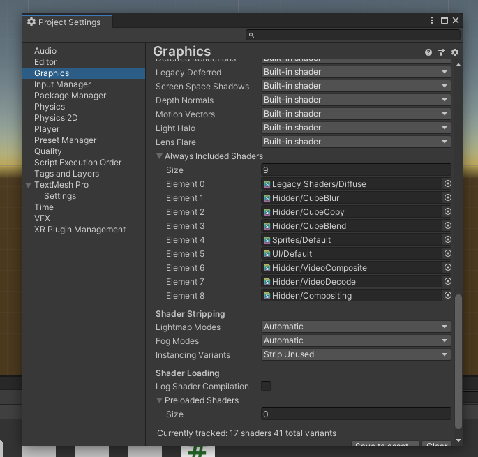

# Building

Include scenes in next order

MainMenu -> 0 
RoomBuilding -> 1
Room1 -> 2
Room2 -> 3
Room3 -> 4

And remember to include shaders required when building from edit/projectSettings/graphics

